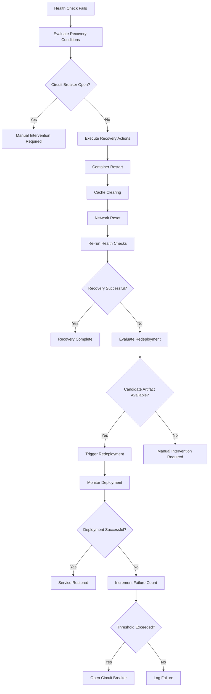

# Recovery and Redeployment System

This document describes the automated recovery and redeployment system implemented in the CI/CD pipeline.

## Overview

The recovery system provides automated responses to service health failures through a multi-stage approach:

1. **Health Monitoring** - Continuous monitoring detects service issues
2. **Recovery Actions** - Non-destructive actions attempt to restore service health
3. **Redeployment** - If recovery fails, deploy a different tested artifact
4. **Circuit Breaker** - Prevents runaway automation when repeated failures occur

## Components

### Health Monitor Workflow (`.github/workflows/health-monitor.yml`)

- Runs every 5 minutes via cron schedule
- Executes comprehensive health checks using `scripts/health_check.py`
- Evaluates recovery conditions based on health status
- Triggers recovery workflow when needed

### Recovery Workflow (`.github/workflows/recovery.yml`)

- Triggered by health monitor or manual intervention
- Implements circuit breaker pattern to prevent runaway automation
- Executes non-destructive recovery actions
- Evaluates redeployment conditions and triggers deployment if needed

### Circuit Breaker Management

- Tracks recovery failure count
- Opens circuit breaker when failure threshold is exceeded
- Requires manual intervention when open
- Managed via `scripts/circuit_breaker.py` utility

## Recovery Process Flow



## Recovery Actions

The system implements three types of non-destructive recovery actions:

### 1. Container Restart
- Restarts the application container without changing the deployed artifact
- Handles containers in various states (running, stopped, crashed)
- Preserves the current Docker image and configuration

### 2. Cache Clearing
- Clears Docker system cache (excluding volumes)
- Removes temporary application files
- Non-destructive to application data

### 3. Network Connectivity Reset
- Resets Tailscale connectivity within the container
- Reconnects container to Docker networks
- Addresses network-related issues

## Circuit Breaker

The circuit breaker system prevents runaway automation by limiting repeated automated corrective actions. It operates on two separate failure tracks:

### Recovery Circuit Breaker
- **Purpose**: Prevents repeated recovery attempts that aren't working
- **Threshold**: 3 failures (configurable via `CIRCUIT_BREAKER_THRESHOLD`)
- **Scope**: Blocks recovery actions and redeployments
- **Reset**: Manual intervention required

### Deployment Circuit Breaker  
- **Purpose**: Prevents repeated deployment failures
- **Threshold**: 5 failures (configurable via `DEPLOYMENT_CIRCUIT_BREAKER_THRESHOLD`)
- **Scope**: Blocks automated deployments (manual deployments can override)
- **Reset**: Manual intervention required

### Circuit Breaker States

#### Closed (Normal Operation)
- All automated actions allowed
- Failure counts tracked but below thresholds
- System operates normally

#### Open (Manual Intervention Required)
- Automated recovery actions blocked
- Automated deployments blocked (with manual override option)
- Manual investigation and fixes required
- Must be manually reset after fixes

### Enhanced Circuit Breaker Management

Use the enhanced `scripts/circuit_breaker.py` utility:

```bash
# Check comprehensive status
python scripts/circuit_breaker.py --repo owner/repo status

# Check status with JSON output
python scripts/circuit_breaker.py --repo owner/repo status --json

# View event log
python scripts/circuit_breaker.py --repo owner/repo events

# Check thresholds and auto-open if needed
python scripts/circuit_breaker.py --repo owner/repo check

# Manually open circuit breaker
python scripts/circuit_breaker.py --repo owner/repo open --reason "maintenance"

# Close circuit breaker and reset failure counts
python scripts/circuit_breaker.py --repo owner/repo close

# Close circuit breaker but keep failure counts
python scripts/circuit_breaker.py --repo owner/repo close --keep-failures

# Set recovery failure threshold
python scripts/circuit_breaker.py --repo owner/repo threshold 5

# Set deployment failure threshold  
python scripts/circuit_breaker.py --repo owner/repo deployment-threshold 3

# Export comprehensive status and logs
python scripts/circuit_breaker.py --repo owner/repo status --export circuit_breaker_status.json

# View recovery history
python scripts/circuit_breaker.py --repo owner/repo history
```

### Automated Monitoring

The circuit breaker includes automated monitoring via scheduled workflows:

- **Hourly Status Checks**: Automatic monitoring every hour
- **Threshold Enforcement**: Auto-opening when thresholds exceeded
- **Event Logging**: Comprehensive logging of all circuit breaker events
- **Manual Workflow Actions**: On-demand status, reset, and export capabilities

## Redeployment Logic

When recovery actions fail to restore service health:

1. **Candidate Selection**: Find a different tested artifact
   - Prioritizes backup artifact from previous deployment
   - Ensures candidate differs from currently deployed artifact
   - Validates artifact availability in registry

2. **Redeployment Execution**: Trigger deployment workflow
   - Uses existing deployment workflow for consistency
   - Tracks redeployment attempts separately from regular deployments
   - Integrates with deployment verification process

3. **Failure Handling**: Manage redeployment failures
   - Increment circuit breaker failure count
   - Record detailed failure information
   - Escalate to manual intervention if threshold exceeded

## Manual Intervention

When automated recovery fails or circuit breaker opens:

### Immediate Actions
1. **Investigate Root Cause**: Review logs and system state
2. **Manual Recovery**: Perform manual fixes as needed
3. **Reset Circuit Breaker**: Use circuit breaker utility
4. **Test Recovery**: Verify fixes before re-enabling automation

### Circuit Breaker Reset
```bash
# Check current status
python scripts/circuit_breaker.py --repo owner/repo status

# Close circuit breaker after fixing issues
python scripts/circuit_breaker.py --repo owner/repo close

# Optionally adjust threshold
python scripts/circuit_breaker.py --repo owner/repo threshold 5
```

### Manual Recovery Workflow
```bash
# Trigger recovery manually with specific parameters
gh workflow run recovery.yml \
  --field health_status="unhealthy" \
  --field recovery_reason="manually_forced" \
  --field triggered_by="manual"
```

## Monitoring and Observability

### GitHub Variables
The system uses GitHub repository variables for state tracking:

- `CIRCUIT_BREAKER_STATUS`: Current circuit breaker state
- `RECOVERY_FAILURE_COUNT`: Number of consecutive failures
- `DEPLOYED_ARTIFACT_DIGEST`: Currently deployed artifact
- `LAST_HEALTH_CHECK_STATUS`: Most recent health check result
- `RECOVERY_SESSION_ID`: Current recovery session identifier

### Artifact Manager Integration
Recovery events are recorded in the artifact management system:

- Recovery attempts and outcomes
- Redeployment triggers and results
- Health check results
- Circuit breaker events

### Workflow Summaries
Each recovery workflow execution generates a comprehensive summary including:

- Recovery session details
- Circuit breaker status
- Recovery actions performed
- Redeployment evaluation results
- Current system state
- Recommended next actions

## Configuration

### Environment Variables
- `GITHUB_TOKEN`: Required for GitHub API access
- `TAILPASTE_URL`: Service URL for health checks (default: http://localhost:8080)
- `STORAGE_PATH`: Database path for health checks (default: ./storage)

### GitHub Repository Variables
- `CIRCUIT_BREAKER_THRESHOLD`: Failure threshold (default: 3)
- `CIRCUIT_BREAKER_STATUS`: Current state (closed/open)
- `RECOVERY_FAILURE_COUNT`: Current failure count

### Workflow Inputs
Recovery workflow supports various input parameters:
- `health_status`: Current health status (unhealthy/degraded/unknown)
- `recovery_reason`: Reason for recovery (health_check_failed/persistent_degradation/etc.)
- `skip_recovery_actions`: Skip directly to redeployment evaluation
- `force_redeployment`: Force redeployment even if recovery succeeds

## Best Practices

### For Operators
1. **Monitor Circuit Breaker**: Check status regularly during incidents
2. **Investigate Root Causes**: Don't just reset - understand why failures occur
3. **Gradual Re-enablement**: Test manually before resetting circuit breaker
4. **Threshold Tuning**: Adjust failure threshold based on system characteristics

### For Developers
1. **Health Check Quality**: Ensure health checks accurately reflect service state
2. **Recovery-Friendly Code**: Design services to handle container restarts gracefully
3. **Artifact Management**: Maintain multiple deployable artifacts for redeployment options
4. **Monitoring Integration**: Use artifact manager for comprehensive tracking

### For System Administrators
1. **Resource Monitoring**: Ensure adequate resources for recovery actions
2. **Network Stability**: Maintain stable network connectivity for remote operations
3. **Backup Strategy**: Ensure reliable artifact backup and restoration
4. **Access Control**: Secure GitHub tokens and repository access

## Troubleshooting

### Common Issues

#### Circuit Breaker Stuck Open
```bash
# Check status and history
python scripts/circuit_breaker.py --repo owner/repo status
python scripts/circuit_breaker.py --repo owner/repo history

# Reset after fixing root cause
python scripts/circuit_breaker.py --repo owner/repo close
```

#### Recovery Actions Failing
1. Check container status on target host
2. Verify SSH connectivity to deployment target
3. Review Docker daemon status and resources
4. Check Tailscale connectivity

#### No Redeployment Candidates
1. Verify artifact backup process is working
2. Check artifact registry connectivity
3. Ensure multiple successful deployments have occurred
4. Review artifact management system logs

#### Health Checks False Positives
1. Review health check configuration
2. Adjust health check thresholds
3. Improve service startup time
4. Consider health check retry logic

### Debug Commands

```bash
# Check system state
gh variable list --repo owner/repo | grep -E "(CIRCUIT|RECOVERY|DEPLOYMENT|HEALTH)"

# View recent workflow runs
gh run list --repo owner/repo --workflow=recovery.yml --limit=10

# Check artifact status
python scripts/artifact_manager.py get-status --digest <digest>

# Manual health check
python scripts/health_check.py --json --export /tmp/health_results.json
```

## Security Considerations

- **GitHub Token Security**: Use minimal required permissions
- **SSH Key Management**: Secure deployment host access
- **Artifact Registry**: Ensure secure artifact storage and access
- **Network Security**: Protect Tailscale and deployment network access
- **Audit Logging**: All recovery actions are logged for audit purposes

## Future Enhancements

Potential improvements to the recovery system:

1. **Advanced Candidate Selection**: More sophisticated artifact selection algorithms
2. **Gradual Rollout**: Canary deployments for redeployment
3. **Predictive Recovery**: Machine learning-based failure prediction
4. **Multi-Environment Support**: Recovery across multiple deployment environments
5. **Integration Hooks**: Webhook notifications for recovery events
6. **Performance Metrics**: Detailed recovery performance tracking